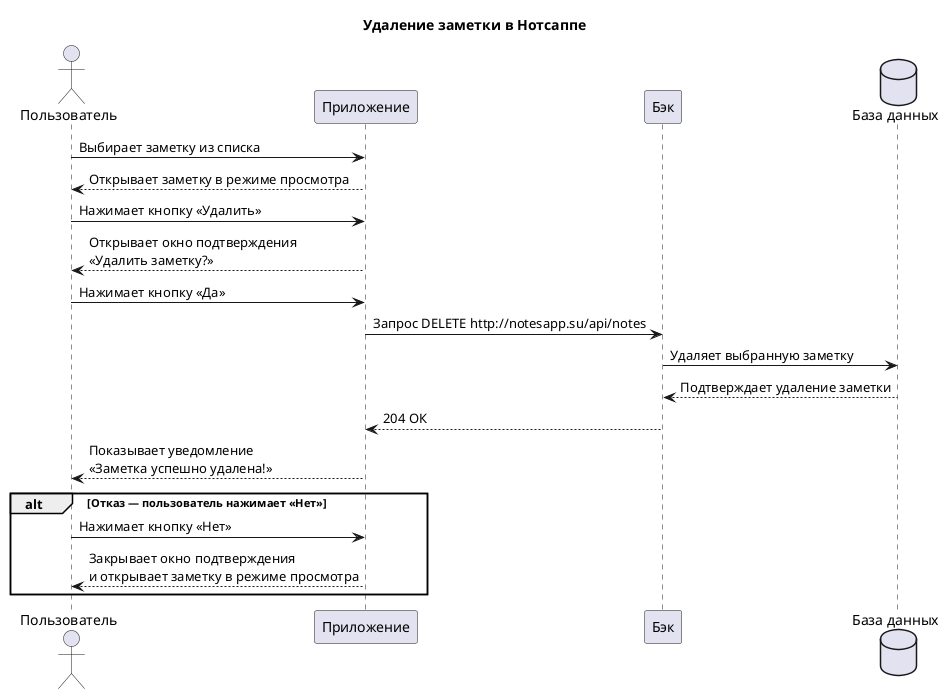

# Диаграмма последовательности

```puml
@startuml
title Удаление заметки в Нотсаппе

actor Пользователь as user
participant Приложение as client
participant Бэк as server
database "База данных" as db

user -> client: Выбирает заметку из списка
client --> user: Открывает заметку в режиме просмотра

user -> client: Нажимает кнопку «Удалить»
client --> user: Открывает окно подтверждения\n«Удалить заметку?»

    user -> client: Нажимает кнопку «Да»
    client -> server: Запрос DELETE http://notesapp.su/api/notes
    server -> db: Удаляет выбранную заметку
    db --> server: Подтверждает удаление заметки
    server --> client: 204 ОК
    client --> user: Показывает уведомление\n«Заметка успешно удалена!»

alt Отказ — пользователь нажимает «Нет»

    user -> client: Нажимает кнопку «Нет»
    client --> user: Закрывает окно подтверждения\nи открывает заметку в режиме просмотра

end

@enduml
```