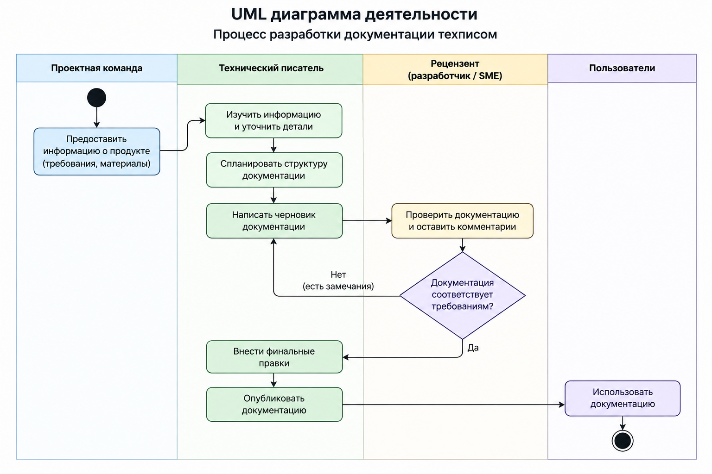

# Диаграммы

## Процесс разработки документации

UML-диаграмма деятельности показывает процесс создания технической документации: от получения информации о продукте до публикации документации для пользователей.

