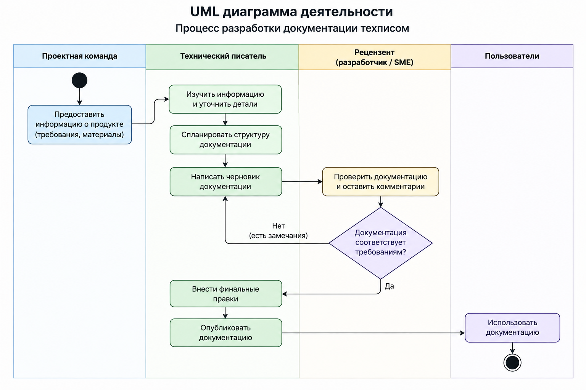

# Диаграммы

В этом разделе представлены две диаграммы:

- [Диаграмма последовательности →](../diagram.md) — показывает взаимодействие пользователя и системы при удалении заметки.

- **Процесс разработки документации** — UML-диаграмма деятельности, представленная ниже.

## Процесс разработки документации

UML-диаграмма деятельности показывает процесс создания технической документации: от получения информации о продукте до публикации документации для пользователей.

